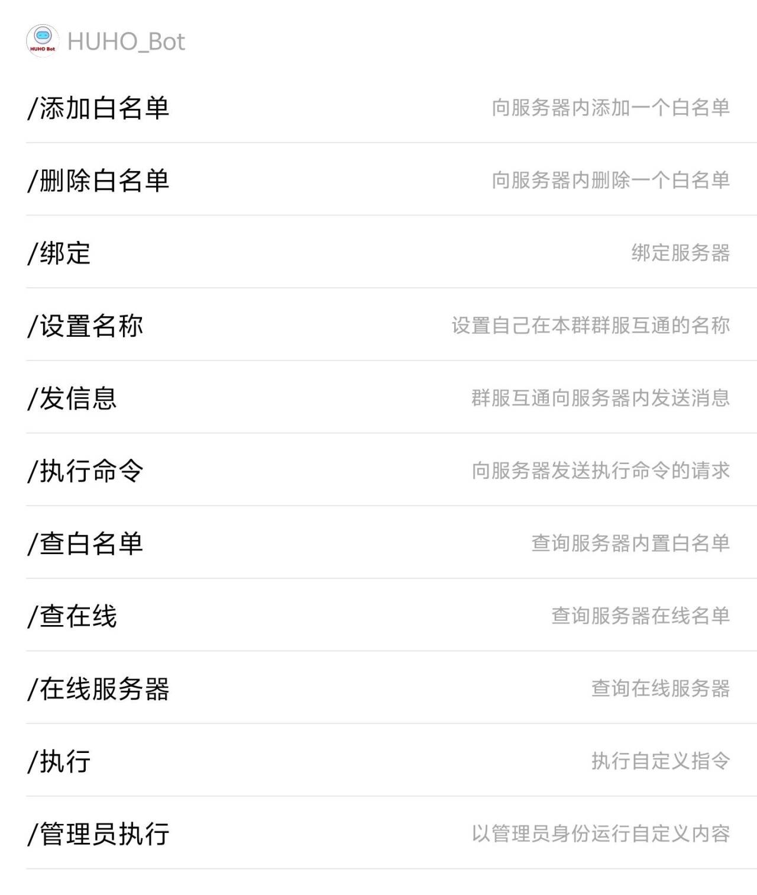
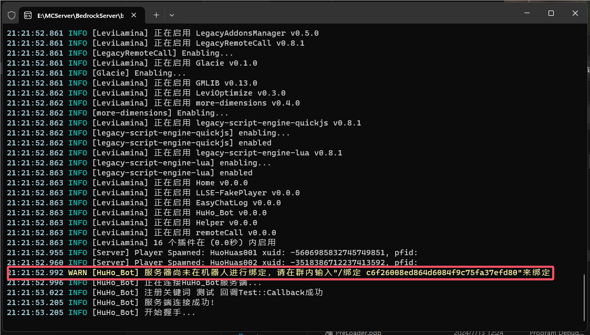
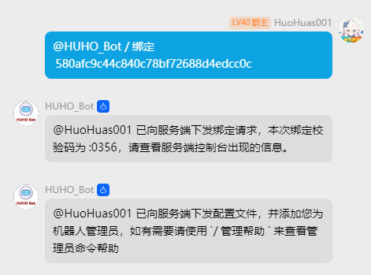
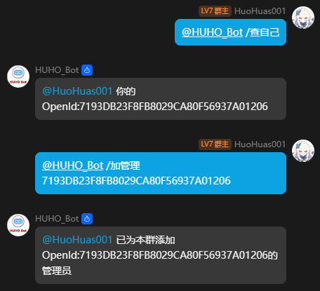

## 对于之前发布的flameHuo框架，许多用户由于各种原因无法自行注册QQ开放平台，
### 现在提供一种全新的机器人接入QQ群！(也有PNX/Spigot版本)


## 特点：

1. 对比于其他机器人框架，无需担心`QQ封号`和`风控`问题，也`无须搭建机器人框架`，解决登录难的问题。

2. 方便易用，仅需`“绑定”`即可快速使用

3. 面板服可用，无须机器人后台，`有网就能用`


## 功能列表：



## 使用方式:

1. 进入[HuHoBot交流群](http://qm.qq.com/cgi-bin/qm/qr?_wv=1027&k=N6tVRxGR8sDwYHBx9YgAhkqRTp1gseyk&authKey=M7Fd3Op6nHjXjSXefBtHBPqIq2wtX8AfufZor9DrfRrJkhyS2rohkt7iuOSwbtn8&noverify=0&group_code=1005746321)

2. 点击HUHO_Bot的头像，并点击添加到群聊


3. 启动BDS服务器，看见控制台出现以下日志


4. 在你想绑定的群聊内发出绑定请求来绑定BDS




5. 愉快使用！(部分功能需要设置为QQ群管理员才能在指令面板内看见，但可以正常触发)

6. 添加管理员示例



7. 配置文件详解

```json
{
    //不用管
    "serverId": null,
    //不用管
    "hashKey": null,

    //服务器在群内的名字
    "serverName": "Server",

    //增加模拟玩家提示
    "addSimulatedPlayerTip": true,

    //使用"/查服"时的Motd图片地址（改成你的进服地址）
    "motdUrl": "play.easecation.net:19132",

    //聊天文本
    "chatFormat": {
        //不用管
        "game": "<{name}> {msg}",
        //群内转发到游戏内的文本
        "group": "群:<{nick}> {msg}"
    },
}
```


8. 自定义执行回调(开发者用)

```javascript
const HUHONAMESPACE = 'HuHo_Bot'
const NAMESPACE = 'Test'

function Callback(params){
    return "测试成功"
}

/**
 * 注册回调函数
 * @param {string} keyWord
 * @param {function} func
 */

function regCallbackEvent(type,keyWord,func){
    if(!ll.hasExported(HUHONAMESPACE,'regEvent')){
        return;
    }
    let regEvent = ll.imports(HUHONAMESPACE,'regEvent')
    ll.exports(func,NAMESPACE,func.name)
    regEvent(type,keyWord,NAMESPACE,func.name)
}

mc.listen("onServerStarted",()=>{
    regCallbackEvent("run","测试",Callback)
})
```
